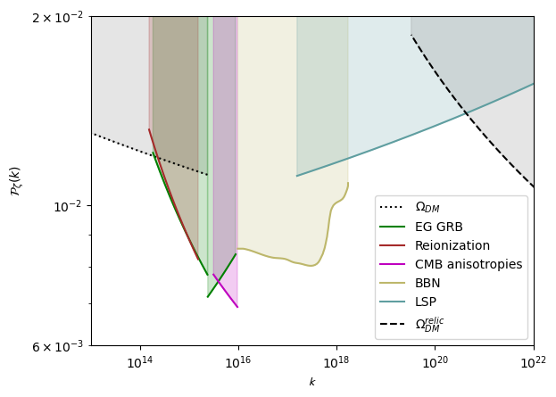
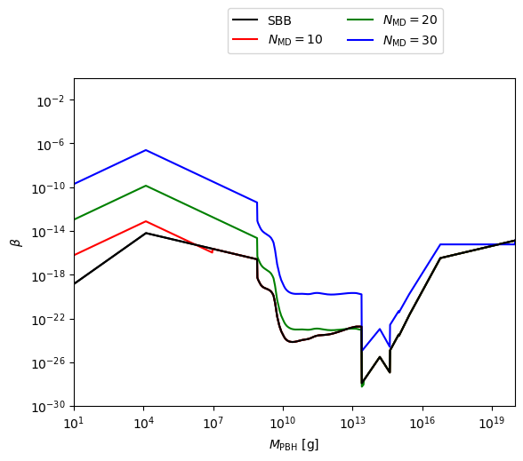
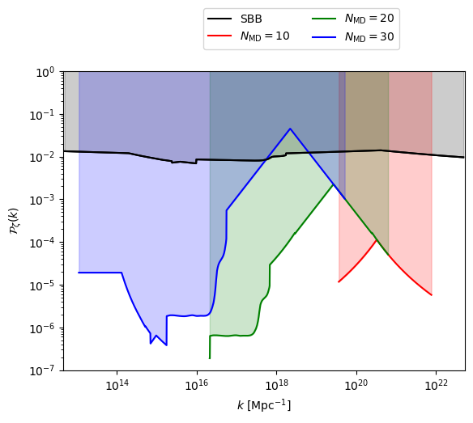
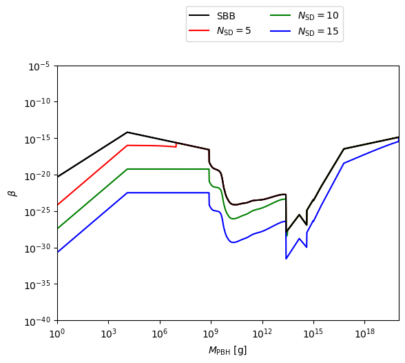
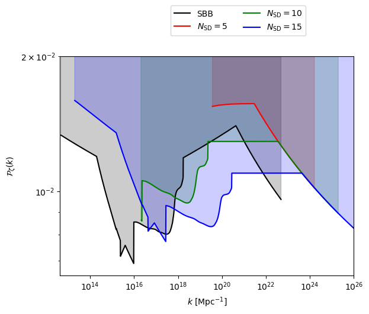

# Jupyter Notebook

The following examples are based on the calculations that were performed to obtain the results in our reference paper [Constraints on primordial black holes for nonstandard cosmologies, Tadeo D. Gomez-Aguilar, Luis E. Padilla, Encieh Erfani, Juan Carlos Hidalgo, arXiv:2308.04642](https://inspirehep.net/literature/2686719).

---

## Primordial Black Holes in Standard Cosmology

**Importing `PBHBeta` Library and Modules:** The initial step involves importing the `PBHBeta` library and its essential modules. This library encompasses the following foundational modules: `constanst.py`, `constraints.py`, `functions.py`, `BfM.py`, `BfS.py`, `PfR.py`, `PfM.py`, and `PfS.py`. For further details about these modules, refer to the [CLASS REFERENCE](../Classes.md) and [MODULES AND COMPONENTS](../Module_1.md) sections.

Furthermore, it's essential to bring in the required dependencies. For additional information, see [Installing dependencies in python](https://pbhbeta.readthedocs.io/en/latest/Requeriments.html#installing-dependencies-in-python).

```python
from PBHBeta import *
import matplotlib.pyplot as plt
import numpy as np
```

**Generating Mass Array Using `put_M_array` Function:** We initiate the process by generating an array of masses using the `put_M_array` function. The primary function to execute is {py:func}`PBHBeta.functions.put_M_array`, which produces an array of masses within specified minimum and maximum mass values, measured in grams. 

**Note:** If you wish to utilize our predefined mass array, consider importing `constraints.data_M_tot`.

```python
functions.put_M_array(2.17645e-5, 1e20)
#constraints.M_tot = constraints.data_M_tot
M_tot = np.array(constraints.M_tot)
omega=1/3
```

**Calculating Constraints for Masses and Abundances:** With the mass array in grams established, we proceed to compute constraints on the abundances of PBH for various masses. This involves employing the key functions: {py:func}`PBHBeta.functions.Betas_BBN`, {py:func}`PBHBeta.functions.Betas_SD`, {py:func}`PBHBeta.functions.CMB_AN`, {py:func}`PBHBeta.functions.Betas_GRB`, {py:func}`PBHBeta.functions.Betas_Reio`, and {py:func}`PBHBeta.functions.Betas_LSP`.

Since several main functions return tuples, we adopt the following syntax to assign each output to distinct variables (further information on return values for each main function is available in the [Main functions](https://pbhbeta.readthedocs.io/en/latest/Module_1.html#main-functions) section).

```{hint}
To disregard or not store the output of a main function, use an underscore (_).
```

```python
M_dm, betas_dm, M_relic, betas_relic ,_  = functions.Betas_DM(M_tot,omega)
```

```{attention}
To implement the above hint, the count of variables should match the number of outputs from each main function. Otherwise, refer to the notation described in the [Using Main Functions](https://pbhbeta.readthedocs.io/en/latest/Quickstart.html#using-main-functions) section.
```

Taking the above into account, we execute all main functions with the parameters `M_tot` and `omega`. We save the resulting masses and PBH abundance constraints for Dark Matter, Big Bang Nucleosynthesis, CMB Anisotropies, Extragalactic Gamma-ray Background, Reionization, Lightest Supersymmetric Particles, and Planck Mass Relics, respectively.

```python
M_bbn = functions.Betas_BBN(M_tot,omega)[0]
M_an = functions.Betas_CMB_AN(M_tot,omega)[0]
M_grb1 = functions.Betas_GRB(M_tot,omega)[0]
M_grb2 = functions.Betas_GRB(M_tot,omega)[1]
M_reio = functions.Betas_Reio(M_tot,omega)[0]
M_lsp = functions.Betas_LSP(M_tot,omega)[0]
```

```python
betas_bbn = functions.Betas_BBN(M_tot,omega)[1]
betas_sd = functions.Betas_SD(M_tot,omega)[1]
betas_an = functions.Betas_CMB_AN(M_tot,omega)[1]
betas_grb1 = functions.Betas_GRB(M_tot,omega)[2]
betas_grb2 = functions.Betas_GRB(M_tot,omega)[3]
betas_reio = functions.Betas_Reio(M_tot,omega)[1]
betas_lsp = functions.Betas_LSP(M_tot,omega)[1]
betas_full = functions.get_Betas_full(M_tot)
```

**Composite Constraints using `get_Betas_full`:** The final instruction entails employing another main function, {py:func}`PBHBeta.functions.get_Betas_full`. This function calculates composite constraint values derived from various PBH constraints. It utilizes the provided `M_tot` parameter and predefined constraint arrays. These composite constraints represent the most robust constraints across diverse scenarios for each specific mass value.

Inside each main function, instructions exist for obtaining PBH abundances during BBN. During this epoch, PBHs with masses $M_{PBH} \leq 10^{9}$ g have already evaporated, and their constraints result from tracing the evolution of the Planck mass remnants left post-evaporation. These abundances are stored within the `constraints.py` module for potential usage. Here's how you can utilize them:

```python
omegas_dm = constraints.Omega_DM_tot
omega_bbn = constraints.Omega_BBN_tot
omega_sd = constraints.Omega_SD_tot
omega_an = constraints.Omega_CMB_AN_tot
omega_grb = constraints.Omega_GRB_tot
omega_reio = constraints.Omega_Reio_tot
omega_lsp = constraints.Omega_LSP_tot
omegas_full = functions.get_Omegas_full(M_tot)
```

**Note:** Similarly to the function `functions.get_Betas_full`, the main function {py:func}`PBHBeta.functions.get_Omegas_full` captures the strongest PBH constraints.

**Creating Plots:** After the basic calculations have been performed, we proceed to generate plots. Here's an example of how to plot constraints on the abundance of monochromatic PBHs as a function of mass in the standard Big Bang scenario.

```python
plt.loglog(M_dm, betas_dm, "k:",label=r"$\Omega_{DM}$")
plt.fill_between(M_dm, betas_dm, betas_dm*0+10, color='grey',alpha=0.2)

plt.loglog(M_relic, betas_relic, "k--",label=r"$\Omega_{DM}^{relic}$")
plt.fill_between(M_relic, betas_relic, betas_relic*0+10, color='grey',alpha=0.2)

plt.loglog(M_bbn, betas_bbn, color = "darkkhaki",label = "BBN")
plt.fill_between(M_bbn, betas_bbn, betas_bbn*0+10, color='darkkhaki',alpha=0.2)

plt.loglog(M_an, betas_an, color='m', label = "CMB anisotropies")
plt.fill_between(M_an, betas_an, betas_an*0+10, color ="m",alpha=0.2)

plt.loglog(M_grb1, betas_grb1, color="g", label="EG GRB")
plt.fill_between(M_grb1, betas_grb1, betas_grb1*0+10, color='g',alpha=0.2)
plt.loglog(M_grb2, betas_grb2, color="g")
plt.fill_between(M_grb2, betas_grb2, betas_grb2*0+10, color='g',alpha=0.2)

plt.loglog(M_reio, betas_reio, color = "brown", label = "Reionization")
plt.fill_between(M_reio, betas_reio, betas_reio*0+10, color='brown',alpha=0.2)

plt.loglog(M_lsp, betas_lsp, color = "cadetblue",label = "LSP")
plt.fill_between(M_lsp, betas_lsp, betas_lsp*0+10, color='cadetblue',alpha=0.2)

plt.xlabel(r"$M_{\rm PBH}~[\rm{g}]$")
plt.ylabel(r"$\beta$")
plt.xlim([1,1e20])
plt.ylim([1e-30,1])

plt.legend(ncol=2,bbox_to_anchor=(1, 1.5))
plt.show()
```

This visual representation illustrates the constraints on PBH abundance for various scenarios. Shaded regions indicate observations that exclude specific ranges.


**Calculating Constraints in Power Spectrum:** To obtain values of $k$ and constraints in the power spectrum, $\mathcal{P}_{\zeta}(k)$, we utilize the function (class) {py:func}`PBHBeta.PfR.get_P_k_RD`. This function performs the following operations:

\begin{equation*}
k = \left(\frac{7.1 \times 10^{-2} \cdot \gamma^{RD} \cdot 1.5\times 10^{15} \cdot H_{end}}{M_{PBH}}\right)^{1/2}\left(\frac{\rho_{0}^{RD}}{\rho_{end}^{inf}}\right)^{1/4},
\end{equation*}
\begin{equation*}
\beta = erfc\left(\frac{\delta_c}{\sqrt{2}\sigma}\right), \ \ \ \ \Rightarrow \ \ \ \ \sigma = \frac{\delta_c}{\sqrt{2}erfc^{-1}(\beta)},
\end{equation*}
where $erfc(x) = 1-erf(x)$ is the complementary error function, $\sigma^2\sim P(k)$ and $\delta_c = 0.41$ in the radiation case. 

Subsequently, we utilize the special function (class) {py:func}`PBHBeta.PfR.get_P_k_RD`, which takes parameters such as an array of masses, an array of PBH abundances, and the value of $\delta_{c}$. This function returns two arrays: one containing the wave number $k$ and the other containing the constraints in the Power Spectrum for each $k$ value.

```python
delta_c = 0.41

k_DM, P_k_DM = PfR.get_P_k_RD(M_dm, betas_dm, delta_c)
k_BBN, P_k_BBN = PfR.get_P_k_RD(M_bbn, betas_bbn, delta_c)
k_AN, P_k_AN = PfR.get_P_k_RD(M_an, betas_an, delta_c)
k_GRB1, P_k_GRB1 = PfR.get_P_k_RD(M_grb1, betas_grb1, delta_c)
k_GRB2, P_k_GRB2 = PfR.get_P_k_RD(M_grb2, betas_grb2, delta_c)
k_Reio, P_k_Reio = PfR.get_P_k_RD(M_reio, betas_reio, delta_c)
k_LSP, P_k_LSP = PfR.get_P_k_RD(M_lsp, betas_lsp, delta_c)
k_DM_relic, P_k_DM_relic = PfR.get_P_k_RD(M_relic, betas_relic, delta_c)
```

```{Important}
The arrays of masses and abundances must have the same dimensional size or number of elements.
```

```{note}
For a future version of `PBHBeta`, we might remove the dependency on the abundance array and solely use an array of masses.
```

**Plotting Constraints on Power Spectrum:** Plotting these values generates constraints imposed on the power spectrum, $\mathcal{P}_{\zeta}(k)$, by PBHs in the standard Big Bang scenario.

```python
plt.loglog(k_DM, P_k_DM, "k:",label=r"$\Omega_{DM}$")
plt.fill_between(k_DM, P_k_DM, P_k_DM*0+10, color='grey',alpha=0.2)

plt.loglog(k_BBN, P_k_BBN, label="BBN",color = "darkkhaki")
plt.fill_between(k_BBN, P_k_BBN, P_k_BBN*0+10, color = "darkkhaki",alpha=0.2)

plt.loglog(k_AN, P_k_AN, "m", label="CMB anisotropies")
plt.fill_between(k_AN, P_k_AN, P_k_AN*0+10, color='m',alpha=0.2)

plt.loglog(k_GRB1, P_k_GRB1, color = "g", label="EG GRB")
plt.fill_between(k_GRB1, P_k_GRB1, P_k_GRB1*0+10, color='g',alpha=0.2)

plt.loglog(k_GRB2, P_k_GRB2, color = "g")
plt.fill_between(k_GRB2, P_k_GRB2, P_k_GRB2*0+10, color='g',alpha=0.2)

plt.loglog(k_Reio, P_k_Reio, color = "brown",label = "Reionization")
plt.fill_between(k_Reio, P_k_Reio, P_k_Reio*0+10, color='brown',alpha=0.2)

plt.loglog(k_LSP, P_k_LSP, color = "cadetblue",label = "LSP")
plt.fill_between(k_LSP, P_k_LSP, P_k_LSP*0+10, color='cadetblue',alpha=0.2)

plt.loglog(k_DM_relic, P_k_DM_relic, "k--",label=r"$\Omega_{DM}^{relic}$")
plt.fill_between(k_DM_relic, P_k_DM_relic, P_k_DM_relic*0+10, color='grey',alpha=0.2)

plt.xlabel(r"$\mathcal{k}$")
plt.ylabel(r"$\mathcal{P}_\zeta(k)$")
plt.xlim([1e13,1e22])
plt.ylim([6e-3,2e-2])
plt.show()

```

This visualization showcases constraints on the power spectrum by PBHs, indicating regions where PBHs have an impact.




Feel free to adjust any part of the rewritten content to match your style or specifications.

---

Before proceeding to the examples in non-standard cosmology, it is necessary to execute once again the special function
(class) {py:func}`PBHBeta.PfR.get_P_k_RD`, evaluating it with the parameters: `M_tot`, which represents our array of PBH masses,
`betas_full`, which contains the array of the most restrictive data points in PBH abundance, and the threshold value `delta_c`.
The generated outputs will be saved in the variables: `k_rd`, which will hold the array of data for different values of $k$ 
in the standard Big Bang scenario (SBB), and consequently, `P_k_rd` will correspond to the array of data for the Power Spectrum (PS) in the SBB.

```python
k_rd, P_k_rd = PfR.get_P_k_RD(M_tot, betas_full, delta_c)
```

---

## Primordial Black Holes in non-standard cosmology

### Early Matter Dominated (MD) scenario

Now we analyze how this early MD epoch will modify the constraints on
the abundance of $\beta_{\rm PBH}$ and PS. For this purpose, we will utilize the {py:func}`PBHBeta.PfM.get_P_k_MD` 
function. This will allow us to obtain, through its parameters: `M_tot`, `N_md`, `omega`, and `gamma_md`, 
the wavenumber $k$, the constraints on the PS and the abundance of PBHs.

The {py:func}`PBHBeta.PfM.get_P_k_MD` function is configured in such a way that the determination of k is carried out using the following instructions:

\begin{equation*}
k_{\rm MD} = \left(\frac{\rho_{r0}}{\rho_{\rm end}}\right)^{1/4}\left(\frac{H_{end}^{2}(\gamma^{\rm MD})(7.1\times 10^{-2})(1.8\times 10^{15})}{M_{\rm PBH}}\right)^{1/3}\exp^{-\frac{1}{4}N_{\rm MD}}
\end{equation*}

It is important to mention that most of the variables (except for the parameters) within this initial instruction 
already have assigned values and are located within the `constraints.py` module.
In other words, the determination of $k$ relies on the values of `M_tot`, `N_md`, and `gamma_md`.

Additionally, the {py:func}`PBHBeta.PfM.get_P_k_MD` function includes a special calculation method for the abundances
in such a way that after the PBHs formation, the evolution of the density parameter, 
$\Omega_{\rm PBH}$, and its relation to $\beta$ are altered compared to the standard cosmological model.

\begin{equation*}
\beta_{\rm MD} = \beta_{\rm MD}\left(N_{\rm reh}, \omega, γ^{\rm MD}\right)
\end{equation*}

```{note}
Certainly, if you prefer, you can utilize this function individually by importing the `BfM.py` module. The function is named `get_betas_reh_tot`, and you can find more detailed information in the documentation of the {py:func}`PBHBeta.BfM.get_betas_reh_tot` function.
```

In other words, this last instruction contains a system of differential equations 
(for more information, refer to the [Basic Functions](https://pbhbeta.readthedocs.io/en/latest/Module_1.html#basic-functions) section),
which is solved under the conditions in which the background universe behaves effectively like a matter-dominated (MD) universe, it's mean
that equation of state, $\omega$ will be `omega = 1`.

To derive such constraints, we based this from the Press-Schechter formalism and instead consider that the physical 
limitations concerning the initial fluctuation's sphericity and conservation of angular momentum determine 
the relationship between `beta` and `sigma`.

\begin{equation*}
\beta \simeq 0.05556\,\sigma^5,\quad \text{for} \quad 0.005\lesssim \sigma\lesssim 0.2\,.
\end{equation*}

```{note}
The particular value of $\gamma^{\rm (MD)}$ is not well known and we thus adopt $\gamma^{\rm (MD)} = 1$
```

```python
k_10s, P_k_10, beta_10 = PfM.get_P_k_MD(M_tot,10,0,1)
k_20s, P_k_20, beta_20 = PfM.get_P_k_MD(M_tot,20,0,1)
k_30s, P_k_30, beta_30 = PfM.get_P_k_MD(M_tot,30,0,1)
```

#### Abundance of PBHs ($\beta_{PBH}$) as function of their mass, where $N_{MD}$ is the total number of $e$-folds that the the MD epoch lasted.

To compare with SBB, we use again `betas_full`.

```python
plt.loglog(M_tot,betas_full, label = "SBB", color='black')
plt.loglog(M_tot,beta_10, label = r"$N_{\rm MD}=10$",color='red')
plt.loglog(M_tot,beta_20, label = r"$N_{\rm MD}=20$",color='green')
plt.loglog(M_tot,beta_30, label = r"$N_{\rm MD}=30$",color='blue')
plt.loglog(M_tot,betas_full, color='black')
plt.ylim([1e-30,1])
plt.xlim([1e1,1e20])
plt.xlabel(r"$M_{\rm PBH}~[\rm{g}]$")
plt.ylabel(r"$\beta$")

plt.legend(ncol=2,bbox_to_anchor=(0.85, 1.23))
plt.show()
```

    

    
#### Constraints on $\mathcal{P}_{\zeta}(k)$ as a function of $k$ for different values of $N_{MD}$.

Analogously we use again `k_rd` and `P_k_rd` to SBB.

```python
plt.loglog(k_rd, P_k_rd,label = "SBB",color='black')
plt.fill_between(k_rd, P_k_rd, P_k_rd*0+10, color='black',alpha=0.2)

plt.loglog(k_10s[:567], P_k_10[:567],color='red' ,label = r"$N_{\rm MD}=10$")
plt.fill_between(k_10s[:567], P_k_10[:567], P_k_10[:567]*0+10, color='red',alpha=0.2)

plt.loglog(k_20s[:816],P_k_20[:816], label = r"$N_{\rm MD}=20$", color='green')
plt.fill_between(k_20s[:816], P_k_20[:816], P_k_10[:816]*0+10, color='green',alpha=0.2)

plt.loglog(k_30s[:1351], P_k_30[:1351], label = r"$N_{\rm MD}=30$", color='blue')
plt.fill_between(k_30s[:1351], P_k_30[:1351], P_k_30[:1351]*0+10, color='blue',alpha=0.2)

plt.loglog(k_rd,P_k_rd,color='black')

plt.xlabel(r"$k~[\rm{Mpc}^{-1}]$")
plt.ylabel(r"$\mathcal{P}_\zeta(k)$")
plt.ylim([1e-7,1])
plt.xlim(0.45e13,5.3e22)
plt.legend(ncol=2,bbox_to_anchor=(0.85, 1.23))
plt.show()
```


    



---


### Stiff fluid Dominated (SD) Scenario


To perform this calculation, the procedure is similar to the one used in the [Early Matter Dominated (MD)](https://pbhbeta.readthedocs.io/en/latest/examples.html#early-matter-dominated-md-scenario) section. In fact, the class `{py:func}PBHBeta.PfS.get_P_k_SD`, which we will use for this procedure, is based on the same algorithm as its counterpart `{py:func}PBHBeta.PfM.get_P_k_MD` with slight differences, mainly in obtaining the wave number $k$.

\begin{equation*}
k_{\rm SD} = \left(\frac{\rho_{r0}}{\rho_{\rm end}}\right)^{1/4}\left(\frac{(\gamma^{\rm MD})(7.1\times 10^{-2})(1.8\times 10^{15})}{M_{\rm PBH}}\right)^{2/3}H_{end}^{1/3}\exp^{-\frac{1}{2}N_{\rm SD}}
\end{equation*}

Similarly, the class `PfM.get_P_k_SD` contains its instruction for the calculation of abundances:

begin{equation*}
\beta_{\rm SD} = \beta_{\rm SD}\left(N_{\rm SD}, \omega, \gamma^{\rm SD}\right)
\end{equation*}

This includes the system of equations that describe the evolution of the population of PBHs after their formation.

```{note}
Certainly, if you prefer, you can utilize this function individually by importing the `BfS.py` module. The function is named `get_betas_reh_tot`, and you can find more detailed information in the documentation of the {py:func}`PBHBeta.BfM.get_betas_reh_tot` function.
```

```{important}
In a SD scenario, we replacing $\gamma^{SD}$ with $\gamma^{SD}$. The particular value of $\gamma^{SD}$ is not well known we shall take $\gamma^{SD} = 1$.
In another hand the equation of state in the early universe becomes stiffer, the threshold value for PBH formation increase because, since pressure is higher, it is harder to collapse and form PBHs. In the limiting case of an equation of state, $\omega = 1$ and we will take $\delta^{SD}_{c} = 0.52$. 
```

On the other hand, to find the constraints on the power spectrum, the definition is used:

\begin{equation*}
\sigma = \frac{\delta_c}{\sqrt{2}\text{erfc}^{-1}(\beta)}
\end{equation*}

assuming that $\delta_{c} = \delta^{SD}_{c} = 0.52$.


```python
k_5st, P_k_5s, beta_s5 = PfS.get_P_k_SD(M_tot,5,1,1)
k_10st, P_k_10s, beta_s10 = PfS.get_P_k_SD(M_tot,10,1,1)
k_15st, P_k_15s, beta_s15 = PfS.get_P_k_SD(M_tot,15,1,1)
```

#### Abundance of PBHs ($\beta_{PBH}$) as function of their mass, where $N_{SD}$ is the total number of $e$-folds that the stiff era lasted.

```python
plt.loglog(M_tot,betas_full, color='black',label = "SBB")
plt.loglog(M_tot,beta_s5,label = r"$N_{\rm SD} = 5$", color='red')
plt.loglog(M_tot,beta_s10,label = r"$N_{\rm SD} = 10$", color='green')
plt.loglog(M_tot,beta_s15,label = r"$N_{\rm SD} = 15$", color='blue')
plt.loglog(M_tot,betas_full, color ='black')

plt.xlabel(r"$M_{\rm PBH}~[\rm{g}]$")
plt.ylabel(r"$\beta$")
plt.ylim([1e-40,1e-5])
plt.xlim([1,1e20])

plt.legend(ncol=2,bbox_to_anchor=(0.85, 1.25))


plt.show()
```


    

    
#### Constraints on $\mathcal{P}_{\zeta}(k)$ as a function of $k$ for the extended SD scenario.

```python
plt.loglog(k_phys_rad, P_k_rd, color='black', label = "SBB")
plt.fill_between(k_phys_rad, P_k_rd, [10]*len(P_k_rd), color='black',alpha=0.2)

plt.loglog(k_5st[:567],P_k_5s[:567], color='red', label = r"$N_{\rm SD}=5$")
plt.fill_between(k_5st[:567], P_k_5s[:567], P_k_5s[:567]*0+10, color='red',alpha=0.2)

plt.loglog(k_10st[:818],P_k_10s[:818], color='green',label = r"$N_{\rm SD}=10$")
plt.fill_between(k_10st[:820], P_k_10s[:820], P_k_10s[:820]*0+10, color='green',alpha=0.2)

plt.loglog(k_15st[:1320],P_k_15s[:1320], color='blue',label = r"$N_{\rm SD}=15$")
plt.fill_between(k_15st[:1320], P_k_15s[:1320], P_k_15s[:1320]*0+10, color='blue',alpha=0.2)


plt.xlabel(r"$k~[\rm{Mpc}^{-1}]$")
plt.ylabel(r"$\mathcal{P}_\zeta(k)$")
plt.ylim([6.5e-3,2e-2])
plt.xlim([4.3e12,1e26])
plt.ylabel(r"$\mathcal{P}_\zeta(k)$")
plt.legend(ncol=2,bbox_to_anchor=(0.85, 1.25))

plt.show()
```


---


